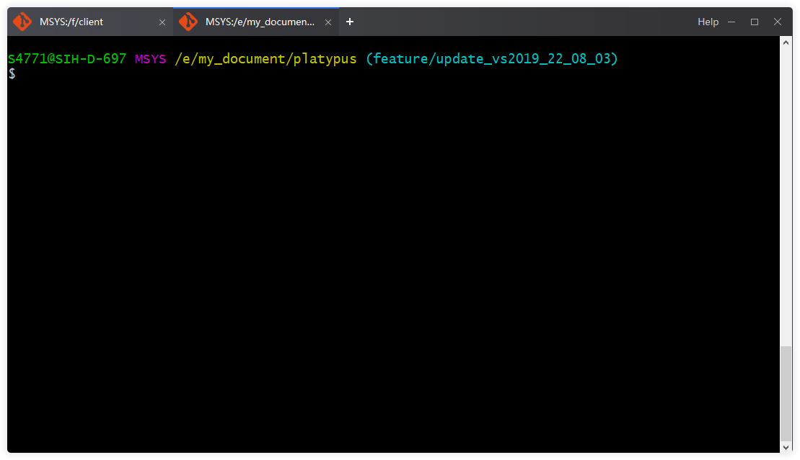

**English | [简体中文](./README_zh.md)**

### 1、What is it？

Platypus is a management of the git bash window. The effect is similar to that of the chrome browser. It manages the bash window and can be switched and created at will.

Windows x64 is currently supported.

Why just support Windows x64?

Because other platforms don’t need 😊, mac and linux both come with a better bash, and the experience is also very good.

Before using this software, you need to install git bash yourself.I believe you have already installed it. 😊

Software screenshot:

​      shortcut key support：

​	

**In order to avoid conflicts with the functions of git bash, it is recommended that you turn off the shortcut key processing of git bash.**

​	

 ### 2. Why write this software?

I tried a lot of software, but all were not satisfactory. For example, powershell, you can use git bash in powershell. But the experience is not good, for example, I can't use the shortcut keys of bash.

This hit me hard.

Another example is that the git command is also integrated in vs code, and the experience cannot reach the native bash.

Mintty actually supports tab management itself, but the effect needs to be improved.

In fact, I have completely expanded the role of git bash, and no longer regard it as a source code management command line, but a complete linux bash.

This can improve my work efficiency.

I have been doing windows development myself. In fact, I am very interested in linux, so I have a feeling of favor for the command line.

### 3. How to compile？

This software is developed based on Qt 5.15.2, of course you can use a higher version.

IDE: vs2019 c++20

notice: Because it is estimated that developers rarely use x86 os, I focused on testing the x64 environment. You need to select the x64 mode when compiling.

 ### 4. Briefly introduce the principle

Here I introduce a few technical points:

1. How to get the title bar information of mintty.exe:

   Using thread injection technology, inject dll into mintty.exe through windows API.

2. How to embed the mintty.exe window into our own program:

   Take advantage of the Qt API.

3. How to get the shortcut key triggered:

   Use keyboard hook to monitor global keyboard messages. notice: But my filtering algorithm is very bad, the effect is not very good.

4. Inter-process communication:

   The event, pipe, and share memory I use are all standard APIs. If you have a lightweight, mature library you can recommend to me.

If you are interested in the rest, just look at the code yourself.。😄，hava fun.

 ### 5. a lot to do.

- [ ] 1、Need to support extended commands

- [x] 2、Optimize the keyboard filtering algorithm

- [x] 3、Sometimes can't get mintty window

- [ ] 4、IPC stability needs to be strengthened

- [ ] 5、The tab window needs refactoring

- [ ] 6、Put the wrong message in the message queue for processing

If you are interested and have ideas, I hope you can join us.

