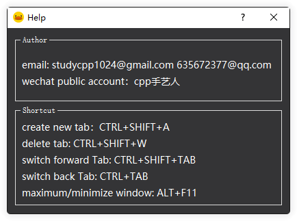

**简体中文 | [English](./README.md)**
### 1、是什么？

platypus 是一个对git bash窗口的管理，效果就是类似chrome浏览器那样，对bash窗口进行管理，可以随意的切换和创建。
目前支持windows x64。
为什么仅支持Windows x64？
因为其他的平台不需要😊，mac && linux都自带了更好用的bash，体验也很好。

在使用此软件之前，你需要自行安装git bash。我相信你已经安装过了。😊

软件截图：

​      快捷键支持：

​	

 ### 2、为什么写这个软件？

我尝试很多的软件，都不尽如人意。比如powershell，在powershell可以使用git bash。但是体验不好，比如我不能使用bash的快捷键。

这对我来说很受打击。

再比如在vs code中也集成了git命令，体验也达不到原生的bash。

mintty其实本身也支持tab管理，但是效果需要提升。

其实我是把git bash的作用完全扩大化了，不再把他当作一个源码管理命令行，而是完完全全的linux的bash。

这样可以给我工作效率的提升。

我本人一直在做windows的开发，其实我对linux十分感兴趣，所以对命令行有种青睐的感觉。

 ### 3、如何编译

此软件是基于Qt 5.15.2版本开发的，当然你可以使用更高的版本。

IDE: vs2019 c++20

notice: 因为现在估计开发者很少用x86 os，所以我着重测试了x64环境，你在编译的时候需要选择x64模式。

 ### 4、简单介绍原理

这里我介绍几个技术点：

1、如何获取mintty.exe 的标题栏信息：

利用线程注入技术，将dll通过windows API注入mintty.exe。

2、如何将mintty.exe窗口嵌入到我们自己的程序中：

利用Qt API。

3、如何获取触发的快捷键：

利用键盘hook，监听全局的键盘消息。notice:但是我过滤算法很差劲，效果并不很好。

4、进程间通信：

剩下的感兴趣就自己看下代码吧。😄，hava fun.

 ### 5、要做的事情很多

TODO:

- [ ] 1、需要支持扩展命令

- [ ] 2、优化键盘过滤算法

- [ ] 3、有时候不能获取mintty窗口

- [ ] 4、IPC稳定性需要加强

- [ ] 5、tab 窗口需要重构

如果你感兴趣，有想法，希望你来一起参加。

